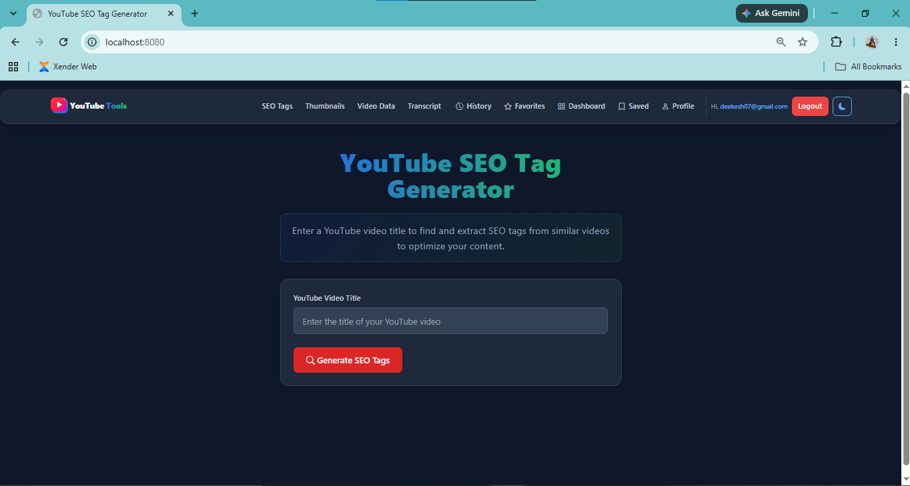
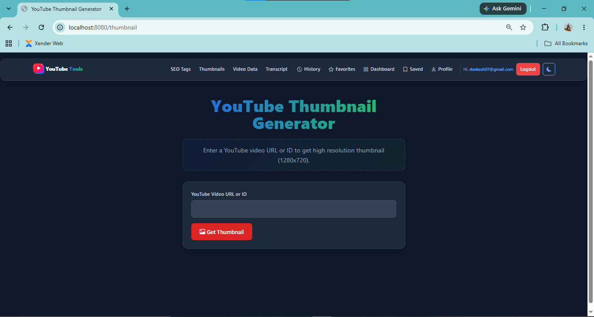
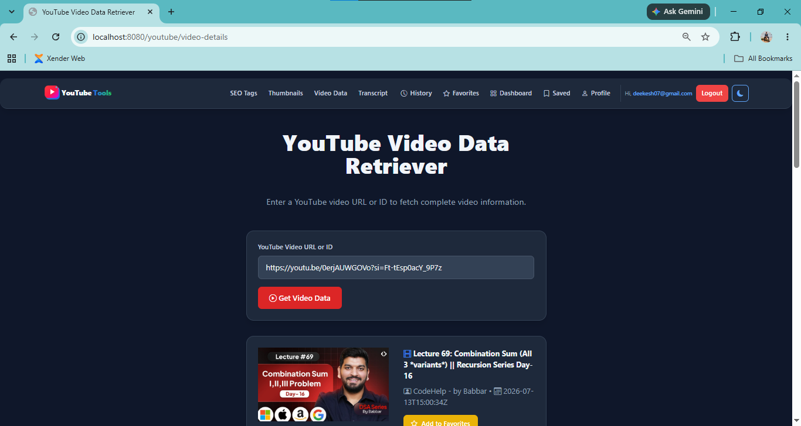
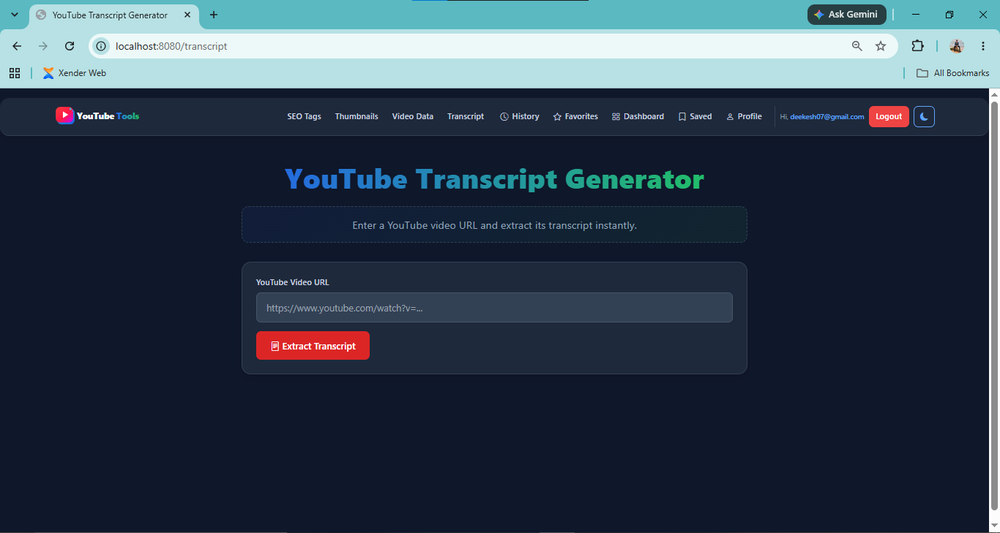
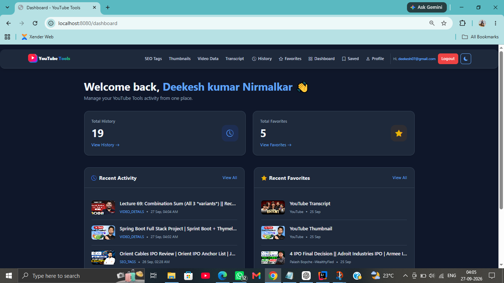
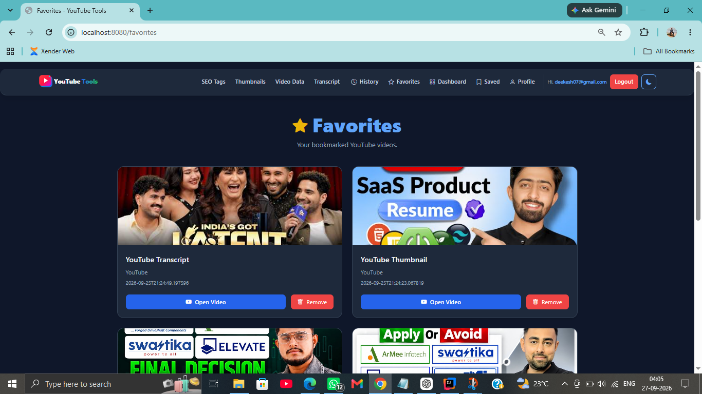
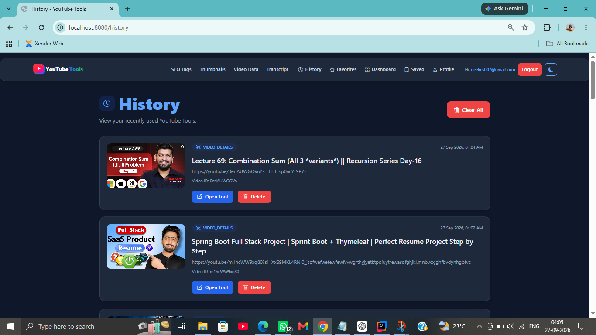
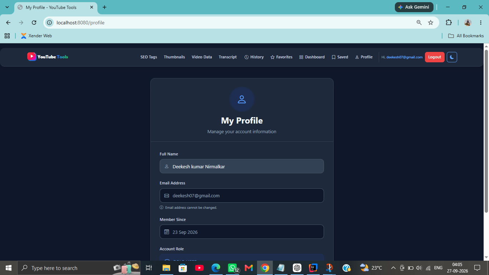
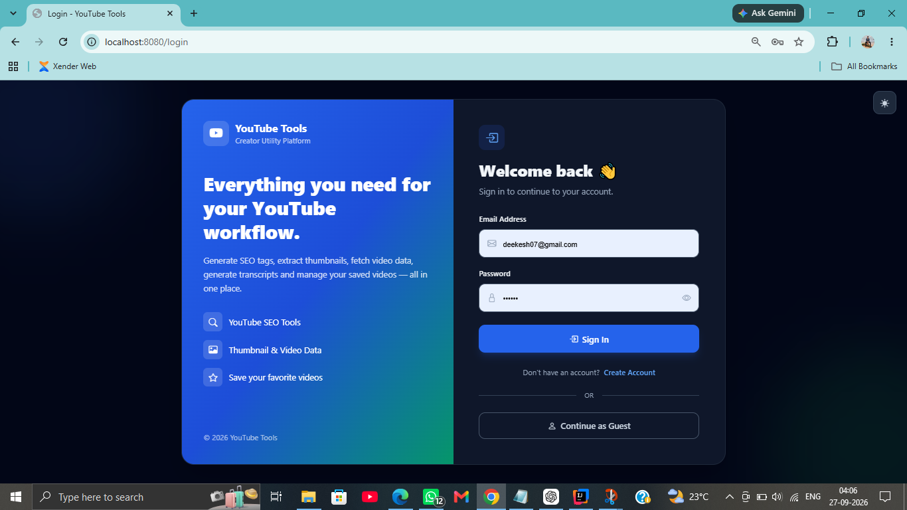
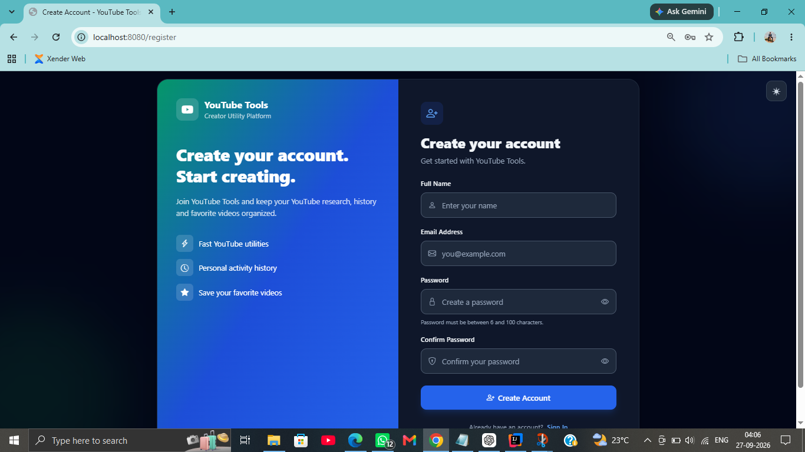

# 🎬 YouTube Tools

> A full-stack YouTube utility platform built with Java, Spring Boot, Thymeleaf, Spring Security, MySQL, and the YouTube Data API.

YouTube Tools provides a collection of practical utilities for YouTube creators and developers, including SEO tag generation, thumbnail extraction, video-data retrieval, and transcript extraction.

The application also includes authentication, user-specific history, favorites, dashboard, saved data, profile management, responsive navigation, dark/light mode, validation, API error handling, and custom error pages.

---

## 🚀 Live Demo & Repository

| Resource | Link |
|---|---|
| 📦 GitHub Repository | [YouTube Tools](https://github.com/deekesh05/YouTube-Tools) |
| 🌐 Live Demo | **Not deployed yet** |

> The application is currently configured as a local Spring Boot application. A production deployment can be added as a future improvement.

---

## ✨ Features

### 🔍 SEO Tag Generator

- Search YouTube videos using a video title
- Fetch the primary matching video
- Fetch related videos
- Extract SEO tags
- Copy primary-video tags
- Copy all related-video tags
- Add videos to favorites
- Save authenticated searches to history
- Loading state while generating results

### 🖼️ YouTube Thumbnail Extractor

- Accept YouTube video URL or video ID
- Extract thumbnail
- Preview thumbnail
- Download thumbnail
- Handle invalid URLs
- Save authenticated requests to history

### 📊 YouTube Video Data

- Accept YouTube video URL or video ID
- Fetch:
    - Title
    - Channel
    - Published date
    - Description
    - Tags
    - Thumbnail
- Download thumbnail
- Add video to favorites
- Save authenticated requests to history

### 📝 YouTube Transcript

- Accept YouTube video URL
- Extract available transcript
- Display transcript
- Handle transcript/API errors
- Save authenticated requests to history

### 👤 Authentication & Security

- User registration
- User login/logout
- Password encryption
- Spring Security authentication
- CSRF protection
- Protected user-specific routes
- User-owned history and favorites
- Duplicate favorite prevention
- Environment-based secrets

### ❤️ Favorites

- Add videos to favorites
- Prevent duplicate favorites
- Remove favorites
- User-specific favorites
- Database-level unique constraint:
  `uk_user_video`

### 🕘 History

- Store authenticated tool usage
- View history
- Delete individual records
- Clear history
- User-specific history

### 📊 Dashboard

- User information
- History count
- Favorite count
- Recent history
- Recent favorites

### 💾 Saved Data

- View saved history
- View favorite videos

### 👤 Profile

- View profile
- Update display name

### 🎨 UI / UX

- Responsive design
- Mobile navigation
- Dark/light mode
- Tailwind CSS
- Bootstrap Icons
- Loading states
- Client-side and server-side validation
- Custom 404 page
- Custom 403 page
- Custom 500 page
- User-friendly API error messages

---

# 🖥️ Screenshots

> Add the application screenshots to the `screenshots/` directory using the filenames below.

### 🏠 Home / SEO Tags



### 🖼️ Thumbnail Extractor



### 📊 Video Data



### 📝 Transcript



### 📊 Dashboard



### ❤️ Favorites



### 🕘 History



### 👤 Profile



### 💾 Saved Data


### 🔐 Login



### 📝 Registration



---

# 🎥 Demo Flow

```text
User
 │
 ├── Register / Login
 │
 ├── SEO Tags
 │     └── Search YouTube → Extract Tags → Favorite / History
 │
 ├── Thumbnail
 │     └── URL / ID → Extract → Preview → Download
 │
 ├── Video Data
 │     └── URL / ID → YouTube API → Video Details
 │
 ├── Transcript
 │     └── URL → Transcript API → Transcript
 │
 └── Dashboard
       ├── History
       ├── Favorites
       ├── Saved Data
       └── Profile
```

---

# 🛠️ Tech Stack

## Backend


## Frontend


## Database & Tools


## APIs

- YouTube Data API v3
- YouTube Transcript API

---

# 🏗️ Project Architecture

The application follows a layered Spring Boot architecture:

```text
┌──────────────────────────────────────────────┐
│                  Frontend                    │
│        Thymeleaf + Tailwind + JavaScript     │
└──────────────────────┬───────────────────────┘
                       │
                       ▼
┌──────────────────────────────────────────────┐
│                 Controllers                  │
│ Auth | YouTube | History | Favorite | etc. │
└──────────────────────┬───────────────────────┘
                       │
                       ▼
┌──────────────────────────────────────────────┐
│                  Services                    │
│ Auth | YouTube | Thumbnail | Transcript    │
│ History | Favorite                           │
└──────────────────────┬───────────────────────┘
                       │
              ┌────────┴────────┐
              ▼                 ▼
┌─────────────────────┐  ┌─────────────────────┐
│    Repositories     │  │   External APIs     │
│   Spring Data JPA   │  │ YouTube Data API   │
└──────────┬──────────┘  │ Transcript API     │
           │             └─────────────────────┘
           ▼
┌──────────────────────────────────────────────┐
│                    MySQL                     │
│ Users | History | Favorites                  │
└──────────────────────────────────────────────┘
```

---

# 📁 Project Structure

```text
YouTubeTools/
│
├── src/
│   ├── main/
│   │   ├── java/com/youtubetools/
│   │   │   ├── Config/
│   │   │   ├── Controller/
│   │   │   ├── DTO/
│   │   │   ├── Entity/
│   │   │   ├── Model/
│   │   │   ├── Repository/
│   │   │   ├── Service/
│   │   │   └── YouTubeToolsApplication.java
│   │   │
│   │   └── resources/
│   │       ├── static/
│   │       ├── templates/
│   │       └── application.properties
│   │
│   └── test/
│
├── screenshots/
├── .env.example
├── .gitignore
├── pom.xml
└── README.md
```

---

# 🔐 Security & Configuration

Sensitive credentials are **not stored directly in source code**.

### Environment variables

```text
YOUTUBE_API_KEY=your_youtube_api_key
DB_USERNAME=root
DB_PASSWORD=your_database_password
```

### `application.properties`

```properties
youtube.api.key=${YOUTUBE_API_KEY}

spring.datasource.username=${DB_USERNAME}
spring.datasource.password=${DB_PASSWORD}
```

The `.env` file and local configuration files are excluded from Git using `.gitignore`.

### API Security

The YouTube API key should be restricted to the APIs required by the application, especially YouTube Data API v3.

> Never commit a real API key, database password, access token, or other private credential to GitHub.

---

# 🚀 Installation

## 1. Clone the repository

```bash
git clone https://github.com/deekesh05/YouTube-Tools.git
cd YouTube-Tools
```

## 2. Requirements

Make sure the following are installed:

- Java
- Maven
- MySQL
- IntelliJ IDEA or another Java IDE
- Git

## 3. Create the database

```sql
CREATE DATABASE youtube_tools;
```

## 4. Configure environment variables

Configure:

```text
YOUTUBE_API_KEY
DB_USERNAME
DB_PASSWORD
```

In IntelliJ IDEA:

```text
Run
 → Edit Configurations
 → Environment variables
```

## 5. Run the application

Windows:

```bash
mvnw.cmd spring-boot:run
```

Or run `YouTubeToolsApplication` directly from IntelliJ IDEA.

---

# 🗄️ Database

The application currently uses MySQL.

Main tables:

```text
users
   │
   ├──────────────< history
   │
   └──────────────< favorites
```

### `users`

Stores registered users.

### `history`

Stores authenticated tool usage.

### `favorites`

Stores user-specific favorite videos.

A unique database constraint prevents the same user from adding the same video more than once:

```text
uk_user_video
(user_id, video_id)
```

---

# 🧪 Validation & Error Handling

The application includes:

- Required-field validation
- Invalid YouTube URL handling
- Video-not-found handling
- Transcript failure handling
- YouTube API failure handling
- Custom 404 page
- Custom 403 page
- Custom 500 page
- User-friendly error messages
- Protected authenticated routes

---

# 📱 Responsive Design

The UI is designed and tested for:

```text
375px   Mobile
425px   Mobile
768px   Tablet
1024px  Laptop
1366px  Desktop
```

The navigation includes a responsive mobile menu with authentication-aware links.

---

# 🧩 Key Engineering Decisions

### User-scoped data

History and favorites are always associated with the authenticated user.

### Duplicate favorite protection

Duplicate favorites are protected at two levels:

1. Application-level existence check
2. Database-level unique constraint

### Secret management

API keys and database credentials are supplied through environment variables rather than hardcoded in source code.

### Error pages

Spring Boot error handling is customized for:

```text
404 Not Found
403 Forbidden
500 Internal Server Error
```

---

# 🔮 Future Improvements

- Production deployment
- Live demo
- Docker support
- CI/CD pipeline
- Automated unit/integration tests
- Pagination for history
- Pagination for favorites
- Advanced transcript language support
- More YouTube utilities
- API caching
- Password change
- Forgot-password flow
- Email verification
- Advanced profile settings
- Production logging and monitoring

---

# 👨‍💻 Portfolio Highlights

This project demonstrates practical experience with:

- Java backend development
- Spring Boot
- Spring Security
- REST/API integration
- WebClient
- Thymeleaf
- MySQL
- JPA/Hibernate
- Authentication & authorization
- CSRF protection
- Database relationships
- User-specific data
- Environment-based configuration
- API error handling
- Responsive frontend development
- Git/GitHub workflow

---

# 📌 Repository

**GitHub:**  
https://github.com/deekesh05/YouTube-Tools

---

## 📄 License

This project is developed for learning and portfolio purposes.
